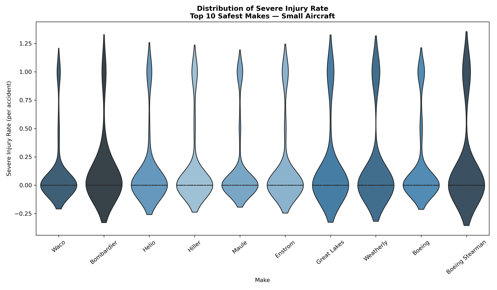
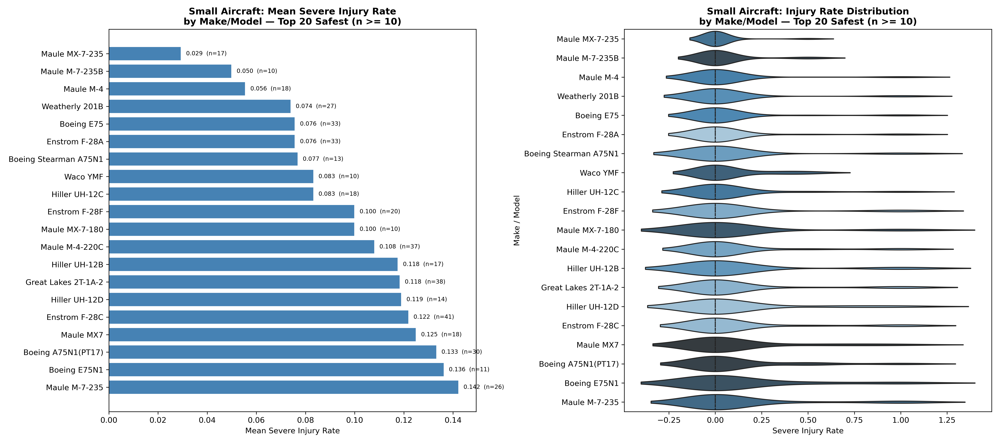
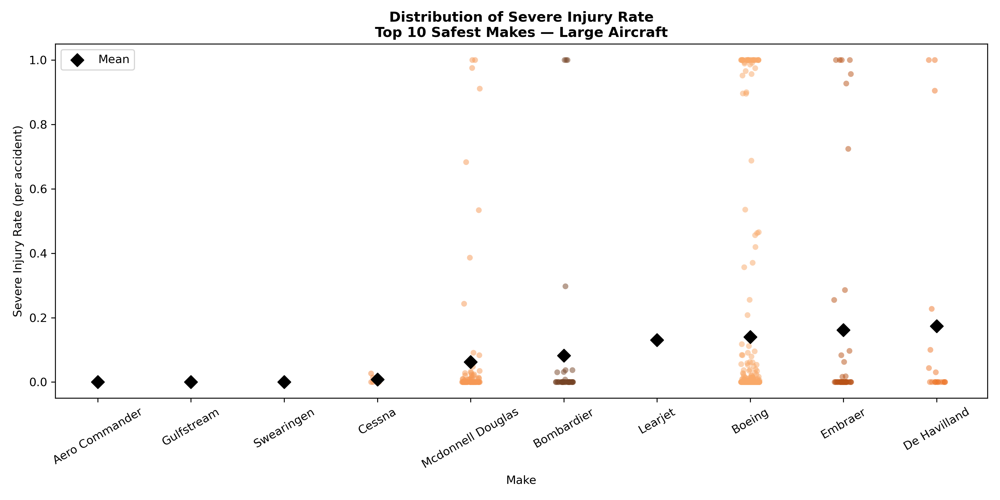
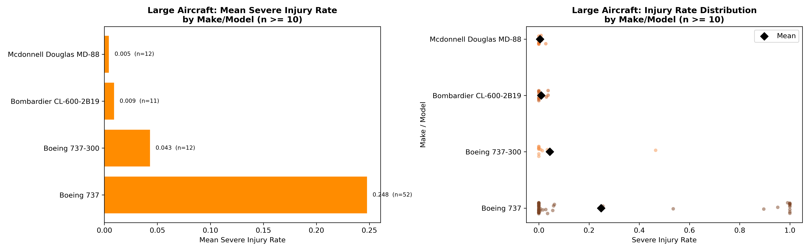
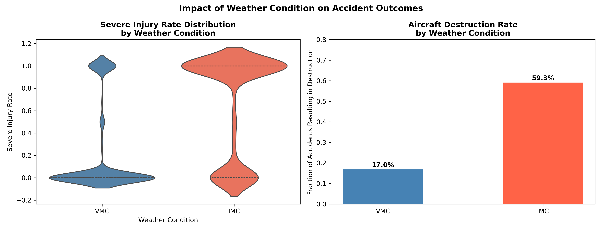
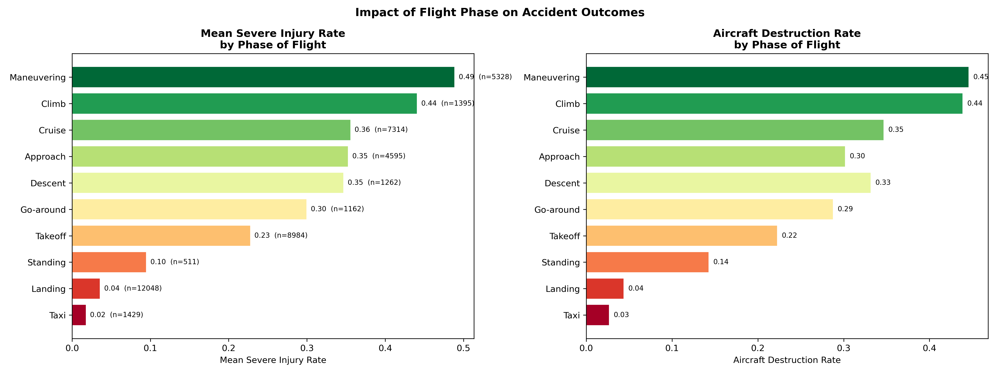

# Aviation Accident Safety Analysis

## Project Overview

This project analyzes aviation accident data to evaluate **safety across aircraft makes and models**, with a focus on outcomes relevant to insurers:

* **Severe injury risk** (fatal + serious injuries)
* **Aircraft destruction likelihood** (total loss events)

The goal is to identify which aircraft types demonstrate **lower risk profiles** in the event of an accident.

---

## Key Metrics

### **Severe Injury Rate**

$$
\text{Severe Injury Rate} = \frac{\text{Fatal + Serious}}{\text{Total Occupants}}
$$

* Measures the proportion of occupants experiencing high-severity outcomes
* Primary safety metric for analysis

### **Destruction Rate**

* Binary indicator (`Is_Destroyed`)
* Represents whether the aircraft was a total loss
* Used as a proxy for **hull-loss risk**

---

## Data Cleaning & Assumptions

* Structured missingness in injury columns was **interpreted and imputed conservatively**
* Rows with no recoverable injury data were dropped
* Remaining missing values were filled with **0 as a lower-bound estimate**
* Columns with **>60% missingness** were removed:

  * `Schedule`
  * `Air.Carrier`
  * `FAR.Description`
  * `Latitude`
  * `Longitude`

These columns were excluded due to:

* High sparsity
* Limited relevance to safety outcomes

---

## Key Findings

### Small Aircraft (Make-Level Analysis)



* Clear separation exists between safer and riskier manufacturers
* Some makes show **consistently low severe injury rates with tight distributions**
* Others exhibit **high variability**, indicating inconsistent safety performance




**Insight:**
Smaller aircraft safety varies significantly by manufacturer, suggesting design and usage patterns strongly influence outcomes.

**Recommended Aircraft:**
The analysis supports the **Diamond DA 20 C1**, the **Piper PA-18A 150**, the **Bell 47D-1**, and the **Cessna 180C** as the standout safest options.

---

### Large Aircraft (Make/Model Analysis, n ≥ 10)



* Most large aircraft models cluster at **low severe injury rates**
* However, certain models show:

  * **Higher mean injury rates**
  * **Wider distributions (risk variability)**



**Insight:**
While large aircraft are generally safer in accidents, **model-level differences still matter**, particularly in extreme outcomes.

**Recommended Aircraft:**
The analysis supports the **McDonnel Douglass MD-88**, and the **Bombardier CL-600-2B19** as the standout safest options.

---

### Destruction Risk

* Destruction rates vary meaningfully across aircraft types
* Some aircraft exhibit:

  * **Low injury rates but high destruction rates**
  * Suggesting strong passenger survivability but poor structural resilience

**Insight:**
Safety is multidimensional—**occupant survival and aircraft loss do not always align**.

---

### Weather Factors



Weather condition is one of the strongest predictors of accident severity in the dataset. Accidents in **IMC (Instrument Meteorological Conditions — low visibility, cloud, fog, precipitation)** are dramatically worse on both metrics compared to **VMC (Visual Meteorological Conditions)**:

---

### Phase of Flight



Phase of flight is the second major driver of accident severity. The results reveal a clear pattern: accidents during high-energy, high-altitude phases (Maneuvering, Climb, Cruise) are dramatically more lethal than those during low-speed, ground-proximate phases (Landing, Taxi).

---

## Final Takeaways

* **Small aircraft safety varies widely** by manufacturer
* **Large aircraft are generally safer**, but model differences remain important
* **Destruction risk and injury risk are not perfectly correlated**
* Conservative data handling ensures results **do not overstate safety**

---

## Potential Next Steps of Analysis

* Incorporate **time trends** (are aircraft getting safer?)
* Explore **operational context** (private vs commercial use)
* Add **geographic analysis** if location data quality improves

---

## Repository Structure

```
├── data/
│   ├── AviationData.csv
│   ├── CleanedAviationData.csv
│   └── USState_Codes.csv
├── images/
│   ├── large_aircraft_bar.png
│   ├── large_aircraft_strip.png
│   ├── phase_of_flight.png
│   ├── small_aircraft_safety_overview.png
│   ├── small_aircraft_violin.png
│   └── weather_conditions.png
├── Aviation_Accidents_Data_Cleaning.ipynb
├── Aviation_Accidents_Data_Analysis.ipynb
└── README.md
```

---

## Summary

This analysis provides a **data-driven view of aircraft safety**, highlighting that:

* Not all aircraft are equal in risk
* Distributional analysis is critical (not just averages)
* Conservative assumptions ensure trustworthy comparisons

The results support more informed decision-making around **risk assessment and aircraft selection**.
